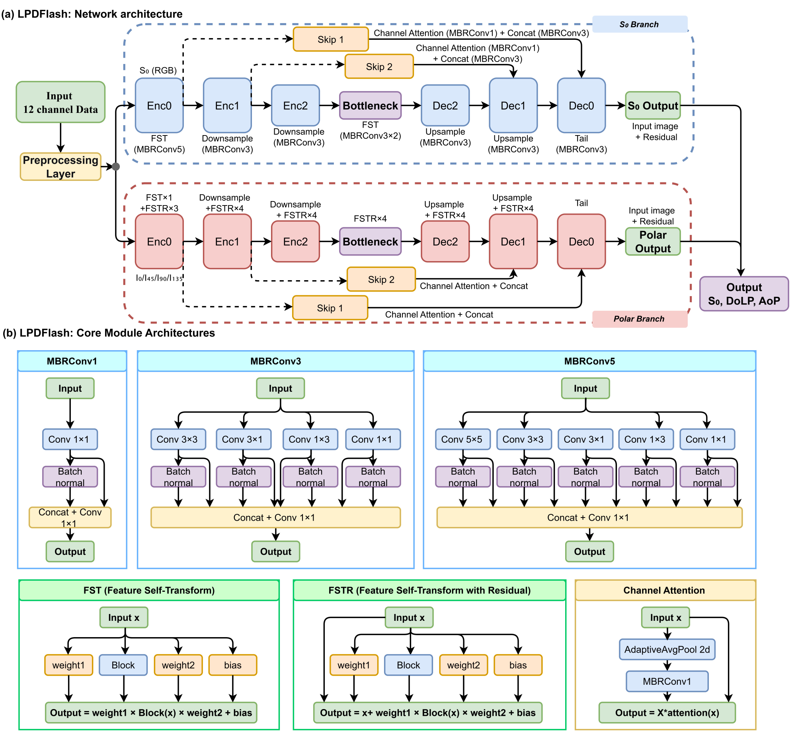

# LPDFlash

**L**ow-light **P**olarization **D**ecoupled **Flash** — a physics-guided,
real-time framework for generalizable low-light polarization image restoration
on division-of-focal-plane (DoFP) cameras.

**Authors:** Ziheng Shang, Junmeng Han, Xiaoyi Hao, Yongji Yu, Yushi Jin,
Long Jin, and Yuan Dong

---

## Overview

Division-of-focal-plane (DoFP) polarization cameras capture four linear
polarization orientations (0°, 45°, 90°, 135°) simultaneously, enabling
real-time polarimetric imaging. Under low-light conditions, the nonlinear
inversion used to compute the degree of linear polarization (DoLP) and angle of
polarization (AoP) severely amplifies sensor noise, degrading the intensity
image (S₀) and, more critically, the polarimetric parameters.

LPDFlash is a lightweight restoration network that simultaneously outputs a
clean intensity image and clean four-orientation polarization channels, from
which S₀, DoLP, and AoP are reconstructed with high fidelity — while running in
real time.

### Key contributions

1. **Multi-branch reparameterized convolutions (MBRConv).** A training–inference
   decoupled convolution block that fuses multiple parallel branches (and their
   batch-norm layers) into a single convolution at inference time. This yields
   **94.6% model-size compression** and **112.08 FPS at 1224×1024**, over 17×
   faster than specialized polarization networks.
2. **Dual-branch decoupled architecture.** Intensity (S₀) and polarimetric
   feature streams are processed by separate multi-scale U-Net branches with
   channel-attention skip connections, mitigating multi-task gradient conflict
   and improving polarimetric fidelity.
3. **Intensity Adaptive Preprocessing (IAP).** A statistics-based luminance
   alignment module that normalizes heterogeneous lighting across datasets and
   scenes, improving robustness under extreme illumination shifts.

---

## Architecture



At inference time, every `MBRConv` block is fused into a single standard
convolution (`model.slim()`), and `FST` blocks collapse to their scale-bias
form, producing the lightweight `LPDFlashSlim` network.

---

## Requirements

- Python ≥ 3.9
- PyTorch ≥ 2.0 (CUDA recommended; a single RTX-class GPU is sufficient)

```bash
pip install -r requirements.txt
```

---

## Pretrained weights

A trained checkpoint (12-channel input, batch-norm reparameterization variant)
is included:

```
best_model.pth   (≈ 23 MB)
```

---

## Data preparation

The model takes a **12-channel input** = 4 polarization orientations × RGB,
stacked in the order

```
[R0, G0, B0, R45, G45, B45, R90, G90, B90, R135, G135, B135]   # [12, H, W], float in [0, 1]
```

Two input modes are supported:

- **`.pt` files** (recommended). Each sample is a dict:
  ```python
  {'format': '12ch', 'clean': Tensor[12, H, W], 'noisy': Tensor[12, H, W]}
  ```
  This is the format consumed by `trainer.py --use_pt`.

- **Image folders**. Each sample folder contains `0.png/45.png/90.png/135.png`
  (or `.bmp`), one RGB image per orientation, used by `test.py` in folder mode.

Noisy images are simulated from clean ones with a **Poisson–Gaussian mixed
noise model**

```
y = Poisson(x) + N(0, σ_read²)
```

optionally preceded by a per-scene low-light scaling factor to emulate
different illumination levels. The intensity adaptive preprocessing (IAP)
aligns the luminance statistics of these heterogeneous inputs:

```
gamma = (C · safety_margin) / (mean + k · std)
```

IAP can be applied either offline as a dataset preprocessing step or online
inside the model via the `iap_enabled` flag (`--use_iap` in `test.py`).

---

## Training

```bash
python trainer.py \
    --clean_root /path/to/Datasets_IAP_pt \
    --train_subdir train \
    --val_subdir val \
    --epochs 200 \
    --use_pt \
    --save_path best_model.pth
```

Useful options:

| Option | Meaning |
|---|---|
| `--freeze_branch {s0,polar}` | Stage-wise training: freeze one branch while training the other |
| `--use_pt` / `--no_pt` | Read `.pt` files (default) vs. raw `0/45/90/135.png` folders |
| `--train_subdir` / `--val_subdir` | Names of the train/val subdirectories under `--clean_root` |
| `--epochs` | Number of training epochs (200 in the paper) |

---

## Inference / testing

```bash
# Folder mode (0/45/90/135.bmp per sample)
python test.py \
    --clean_root /path/to/gt/test \
    --noisy_root /path/to/noisy/test \
    --model_path best_model.pth \
    --output_dir results_test

# .pt mode (12-channel .pt files under --clean_root)
python test.py \
    --clean_root /path/to/pt/test \
    --model_path best_model.pth \
    --output_dir results_test
```

The script reconstructs S₀, DoLP, and AoP from the two branch outputs, saves
visualizations per sample, and dumps an aggregate `test_summary.json` with
per-sample and average metrics.

---

## Evaluation metrics

Reported on S₀, DoLP, and AoP against the clean ground truth:

- **PSNR / SSIM** (S₀ and DoLP)
- **MAE** (DoLP, AoP)
- AoP errors are computed with periodic (modulo-π) wrapping.

---

## Repository structure

```
├── models/
│   ├── __init__.py        # exposes LPDFlash / LPDFlashSlim
│   └── LPDFlash.py        # MBRConv / FST / dual-branch U-Net + slim
├── trainer.py             # training loop, loss, dataset
├── test.py                # inference + evaluation
├── assets/
│   └── architecture.png   # network framework diagram
├── best_model.pth         # pretrained checkpoint
├── requirements.txt
├── LICENSE
└── README.md
```

---

## License

This project is released under the [MIT License](LICENSE).

---

## Citation

If you find LPDFlash useful, please cite:

```bibtex
@misc{shang2026lpdflash,
  author = {Shang, Ziheng and Han, Junmeng and Hao, Xiaoyi and Yu, Yongji and Jin, Yushi and Jin, Long and Dong, Yuan},
  title  = {{LPDFlash}: Physics-Guided Decoupled Learning for Real-Time, Generalizable Low-Light Polarization Image Restoration},
  year   = {2026},
  url    = {https://github.com/shangziheng/LPDFlash}
}
```
